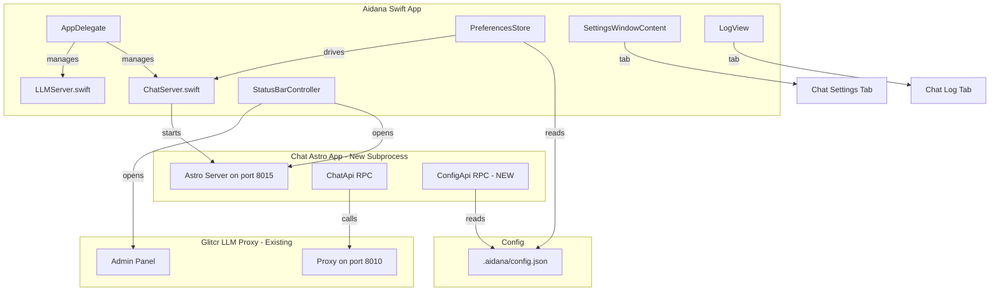
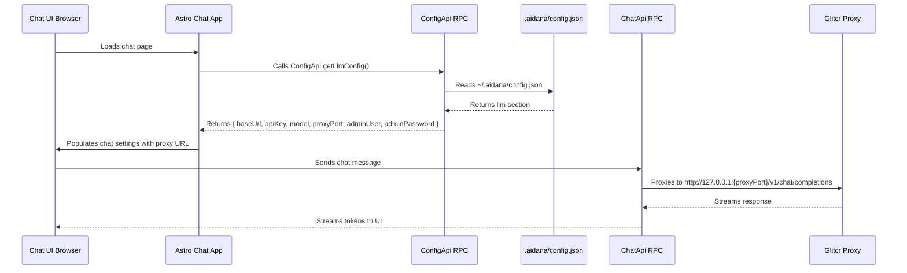

# Chat UI Integration Plan

## Overview

Integrate the existing `./chat` directory (Astro-based AI chat UI) as a hosted subprocess within the Aidana Swift app, following the same integration pattern as MCP, TTS, and LLM (glitcr) servers. The chat will read LLM configuration directly from `~/.aidana/config.json` via an RPC endpoint exposed by the Astro app itself.

## Architecture



## Configuration Flow via RPC



## Changes by File

### 1. New: `Aidana/Server/ChatServer.swift`

Manages the chat Astro app as a subprocess, following the pattern of `LLMServer.swift` and `MCPServer.swift`.

**Key responsibilities:**
- Resolve Bun runtime (system bun or from project)
- Start `bun run dev --port {chatPort}` in `chat/` directory
- Health check on `http://127.0.0.1:{chatPort}/`
- Pipe stdout/stderr to log callback
- `killStaleProcesses()` for cleanup

**LaunchConfiguration:**
```swift
struct LaunchConfiguration: Sendable {
    let chatPort: Int
}
```

**Note:** No `.env` file writing. The chat app reads config directly from `~/.aidana/config.json` via its own RPC endpoint.

### 2. New: `chat/src/rpc/config.ts`

New RPC API class that reads `~/.aidana/config.json` and returns LLM configuration to the frontend:

```typescript
export class ConfigApi {
  async getLlmConfig(): Promise<{
    baseUrl: string;
    apiKey: string;
    model: string;
    proxyPort: number;
    adminUser: string;
    adminPassword: string;
  }> {
    // Read ~/.aidana/config.json using fs
    // Parse llm section
    // Return config with baseUrl derived as http://127.0.0.1:{proxyPort}
  }
}
```

This RPC endpoint is whitelisted (no auth required) since it runs locally and only reads config.

### 3. Modify: `chat/src/rpc.ts`

- Import and add `ConfigApi` to `RpcApi` export
- Add `ConfigApi.getLlmConfig` to the whitelist

### 4. Modify: `chat/src/csr/app.tsx`

On app mount (before rendering), call `ConfigApi.getLlmConfig()` via RPC:
- Apply returned config to `chatStore` settings
- Set `baseUrl` to `http://127.0.0.1:{proxyPort}` (glitcr proxy)
- Auto-login with admin credentials from config
- If config not available yet (proxy not started), use defaults and retry

### 5. Modify: `Aidana/Server/ServerState.swift`

Add `ChatStatus` enum and `chatStatus` property:

```swift
enum ChatStatus: Equatable {
    case stopped
    case starting
    case ready(port: Int)
    case error(String)
    
    var displayText: String { ... }
    var stateKey: String { ... }
    var isReady: Bool { ... }
}

@Published private(set) var chatStatus: ChatStatus = .stopped
func setChatStatus(_ newStatus: ChatStatus) { chatStatus = newStatus }
```

### 6. Modify: `Aidana/Preferences/PreferencesStore.swift`

Add chat-specific preferences:

```swift
@Published var chatAutoStart: Bool { ... }
@Published var chatPort: Int { ... }
```

- Read/write from `config.json` `chat` section
- Default port: `8015`
- Default autoStart: `true`

### 7. Modify: `Aidana/Application/AppDelegate.swift`

- Add `chatLogStore = ChatLogStore()`
- Add `chatServer = ChatServer()`
- Set log callback in `startServer()`
- Start chat server in `startServer()` after LLM proxy is ready
- Add `startChatServer()` method
- Stop chat in `stopServer()` and `applicationWillTerminate()`
- Add `chatServer` environment to `SettingsWindowContent`

### 8. Modify: `Aidana/UI/LogView.swift`

Add `ChatLogTab` to the inner `TabView`:

```swift
ChatLogTab()
    .environmentObject(chatLogStore)
    .tabItem { Label("Chat", systemImage: "bubble.left.and.bubble.right") }
```

With buttons: Copy, Clear, Open Chat (opens browser).

### 9. Modify: `Aidana/Application/AppDelegate.swift` - SettingsWindowContent

Add `ChatPreferencesTab` to the outer `TabView`:

```swift
ChatPreferencesTab()
    .environmentObject(preferences)
    .environmentObject(serverState)
    .tabItem { Label("Chat", systemImage: "bubble.left.and.bubble.right") }
    .tag("chat")
```

**ChatPreferencesTab** content:
- Auto-start toggle
- Port field
- Start/Stop buttons
- LLM proxy URL display (read-only, derived from config)

### 10. Modify: `Aidana/UI/MenuBar/StatusBarController.swift`

Add two new menu items before the "Log..." separator:

```swift
private let openChatItem = NSMenuItem(title: "Open Chat...", action: #selector(handleOpenChat), keyEquivalent: "")
private let openLlmAdminItem = NSMenuItem(title: "Open LLM Proxy Admin...", action: #selector(handleOpenLlmAdmin), keyEquivalent: "")
```

Menu order:
```
ASR info
TTS info
MCP info
LLM info
Separator
Open Chat...
Open LLM Proxy Admin...
Separator
Log...
Preferences...
Separator
Quit
```

Add notification names:
```swift
static let openChatRequested = Notification.Name("com.aidana.openChatRequested")
static let openLlmAdminRequested = Notification.Name("com.aidana.openLlmAdminRequested")
```

### 11. Modify: `chat/astro.config.ts`

- Read port from environment variable `CHAT_PORT` or default to `8015`
- Ensure the dev server binds to `127.0.0.1` for local-only access

### 12. Modify: `Aidana/Support/LogStore.swift`

Add `ChatLogStore` subclass:

```swift
@MainActor
final class ChatLogStore: LogStore {}
```

## Key Design Decisions

1. **Config via RPC, not .env**: The chat app exposes a `ConfigApi` RPC endpoint that reads `~/.aidana/config.json` directly. This means:
   - No need to restart the chat when config changes
   - Config is always in sync with what Aidana writes
   - Single source of truth (config.json)
   - The frontend fetches config on load via RPC call

2. **Chat connects to LLM via glitcr proxy**: The `ConfigApi` returns the proxy port, and the chat UI constructs `baseUrl = http://127.0.0.1:{proxyPort}`. All LLM traffic flows through the proxy for audit logging and security.

3. **Auto-login with proxy credentials**: The config includes admin credentials for the glitcr proxy. The chat UI auto-authenticates using these.

4. **Bun runtime**: The chat app uses Bun (per `packageManager` in package.json). ChatServer will use system Bun (`bun run dev`).

5. **Port allocation**: Chat defaults to port 8015, keeping it in the same range as glitcr (8010).

## Implementation Order

1. `LogStore.swift` - Add ChatLogStore subclass
2. `chat/src/rpc/config.ts` - New ConfigApi RPC endpoint
3. `chat/src/rpc.ts` - Add ConfigApi to exports and whitelist
4. `chat/src/csr/app.tsx` - Fetch config via RPC on mount
5. `chat/astro.config.ts` - Port from environment
6. `ChatServer.swift` - Subprocess manager
7. `ServerState.swift` - Add ChatStatus
8. `PreferencesStore.swift` - Add chat preferences
9. `AppDelegate.swift` - Integrate chat server lifecycle
10. `LogView.swift` - Add Chat log tab
11. `AppDelegate.swift` - Add Chat preferences tab
12. `StatusBarController.swift` - Add menu items
13. Build and test integration
