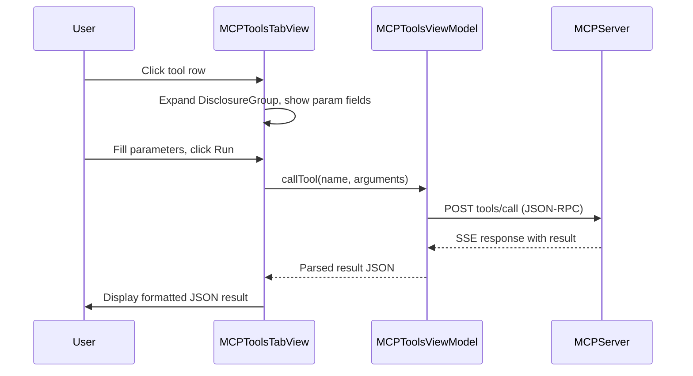
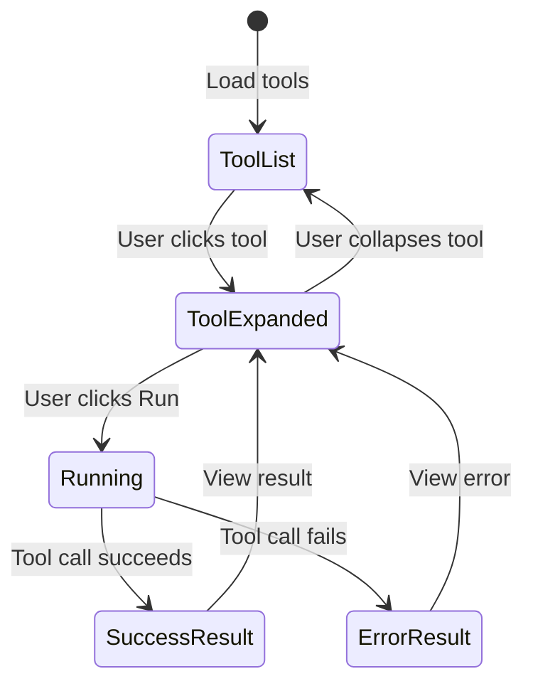

# Clickable MCP Tools UI - Architecture Plan

## Overview
Enhance the MCP Tools tab to make each tool clickable, showing parameter input fields derived from the tool's `inputSchema`, a Run button to execute the tool, and a JSON-formatted result display.

## Architecture Diagram



## Mermaid State Diagram



---

## 1. Model Layer Changes

### 1.1 New Types in `MCPToolsViewModel.swift`

Add the following structs to represent the tool parameter schema:

**`MCPToolParameter`** - Represents a single parameter definition:
```swift
struct MCPToolParameter: Codable, Sendable {
    let type: String          // "string", "array", "object", "number", "boolean"
    let description: String?
    let defaultValue: Any?    // Optional default value
    let properties: [String: MCPToolParameter]?  // Nested properties for "object" type
    let required: [String]?   // Required fields for nested "object" type
}
```

**`MCPToolSchema`** - Represents the full input schema:
```swift
struct MCPToolSchema: Codable, Sendable {
    let type: String          // Always "object"
    let properties: [String: MCPToolParameter]
    let required: [String]
}
```

### 1.2 Update `MCPTool` Struct

Add `inputSchema` field:
```swift
struct MCPTool: Identifiable, Codable, Sendable {
    let id: String
    let name: String
    let description: String
    let inputSchema: MCPToolSchema?  // NEW
}
```

### 1.3 Update `listTools()` Method

The current `listTools()` already receives the full tool definition from the MCP server (including `inputSchema`). Update the parsing to extract and store it:

- The MCP response contains tools with `name`, `description`, and `inputSchema` fields
- Currently only `name` and `description` are parsed
- Update to also parse `inputSchema` into `MCPToolSchema`

---

## 2. View Model Changes

### 2.1 Add `callTool()` Method to `MCPToolsViewModel`

New public method:
```swift
@MainActor
func callTool(_ tool: MCPTool, arguments: [String: Any]) async
```

This method:
1. Constructs a JSON-RPC `tools/call` request with `name` and `arguments`
2. Sends via existing `postMCP()` infrastructure with `mcp-session-id` header
3. Parses SSE response to extract result or error
4. Updates `@Published var toolResult: ToolResult?` to trigger UI update

### 2.2 New `ToolResult` Type

```swift
struct ToolResult: Identifiable, Codable, Sendable {
    let id: String            // Unique ID for this result (UUID)
    let toolName: String
    let arguments: [String: Any]
    let success: Bool
    let result: String        // Formatted JSON string of result or error message
    let timestamp: Date
}
```

### 2.3 New Published Properties

```swift
@Published var toolResult: ToolResult?
@Published var isRunningTool = false
```

### 2.4 Implementation Details for `callTool()`

The MCP `tools/call` JSON-RPC request body:
```json
{
  "jsonrpc": "2.0",
  "id": <requestId>,
  "method": "tools/call",
  "params": {
    "name": "memory_file_save",
    "arguments": {
      "name": "project-notes",
      "content": "# Notes\n...",
      "summary": "Project notes"
    }
  }
}
```

The response (SSE format) will contain:
```json
{
  "jsonrpc": "2.0",
  "id": <requestId>,
  "result": {
    "content": [
      { "type": "text", "text": "..." }
    ],
    "isError": false
  }
}
```

---

## 3. UI Changes

### 3.1 `MCPToolsTabView` Redesign

Replace the current flat `List` with an expandable design:

**Layout:**
```
MCPToolsTabView
  ScrollView
    VStack (spacing: 12)
      ForEach(tools) { tool in
        ToolCardView(tool: tool, viewModel: viewModel)
      }
    If let result = viewModel.toolResult {
      ToolResultView(result: result)
    }
```

### 3.2 New `ToolCardView` Component

A self-contained card for each tool:

```
ToolCardView
  VStack
    HStack (header - tap to expand)
      Image(systemName: "terminal")
      VStack
        Text(tool.name) - .font(.headline)
        Text(tool.description) - .font(.caption).foregroundStyle(.secondary)
      Spacer()
      Image(systemName: expanded ? "chevron.up" : "chevron.down")
    If expanded {
      Divider()
      Padding(.horizontal)
      Padding(.top)
      ParameterForm(inputSchema: tool.inputSchema, onRun: { args in ... })
    }
```

### 3.3 New `ParameterForm` Component

Dynamically renders input fields based on `MCPToolSchema`:

```
ParameterForm
  Form or ScrollView
    ForEach(schema.properties) { name, param in
      switch param.type {
        case "string": TextField with label and prompt text from description
        case "array": TextField with comma-separated input, description hint
        case "number": TextField(.number)
        case "boolean": Toggle
        case "object":
          If param has nested properties (from inputSchema.properties):
            Nested DisclosureGroup with recursive ParameterForm for sub-properties
          Else:
            TextEditor for free-form JSON input
        default: TextField fallback
      }
      If schema.required.contains(name) {
        Text("*") - .foregroundStyle(.red)  // Required indicator
      }
    }
    HStack
      Spacer()
      Button("Run") { validate and call tool }
        .disabled(isRunning || requiredFieldsMissing)
    If isRunning {
      ProgressView()
    }
```

**Parameter Binding Strategy:**
- Use `@State var parameterValues: [String: String]` to store raw text input
- On Run, convert string values to proper types based on schema:
  - `"string"` -> raw string
  - `"array"` -> split by comma, trim, wrap in JSON array
  - `"number"` -> parse as Double/Int
  - `"boolean"` -> parse as Bool
  - `"object"` with nested properties -> recursively build nested `[String: Any]` dict
  - `"object"` without properties -> parse as JSON via `JSONSerialization`

### 3.4 New `ToolResultView` Component

Displays the result of a tool call:

```
ToolResultView
  VStack
    HStack
      Image(systemName: success ? "checkmark.circle.fill" : "exclamationmark.triangle.fill")
      Text(result.toolName) - .font(.headline)
      Spacer()
      Text(result.timestamp, format: ...) - .font(.caption).foregroundStyle(.secondary)
    Divider()
    ScrollView
      Text(result.result) - .font(.system(.size14, design: .monospaced))
        .textSelection(.enabled)
    Button("Dismiss") { dismiss }
```

---

## 4. File Modification Summary

| File | Changes |
|------|---------|
| `Aidana/Support/MCPToolsViewModel.swift` | Add `MCPToolParameter`, `MCPToolSchema`, `ToolResult` types; update `MCPTool` with `inputSchema`; update `listTools()` to parse schema; add `callTool()` method; add `@Published` state for results |
| `Aidana/UI/LogView.swift` | Redesign `MCPToolsTabView`; add `ToolCardView`, `ParameterForm`, `ToolResultView` components |

---

## 5. Implementation Order

1. **Model types** - Add `MCPToolParameter`, `MCPToolSchema`, update `MCPTool`
2. **Parse schema** - Update `listTools()` to extract `inputSchema`
3. **callTool method** - Implement tool execution in view model
4. **ToolResult state** - Add published properties for UI binding
5. **ToolCardView** - Create expandable card component
6. **ParameterForm** - Create dynamic parameter input form
7. **ToolResultView** - Create result display component
8. **Integrate** - Wire everything into `MCPToolsTabView`

---

## 6. Edge Cases and Considerations

- **Tools with no parameters** (like `memory_list_files`): Show only a Run button, no input fields
- **Large text parameters** (like `content`): Use `TextEditor` instead of `TextField` for multi-line input
- **Array parameters**: Comma-separated text input with clear instructions
- **Missing session ID**: If session not initialized, `callTool()` should initialize it first
- **Concurrent tool calls**: Disable Run button while a tool is running; queue or reject new calls
- **Error handling**: Display MCP errors (isError: true) and network errors distinctly
- **JSON formatting**: Use `JSONSerialization` with pretty-printing for result display
