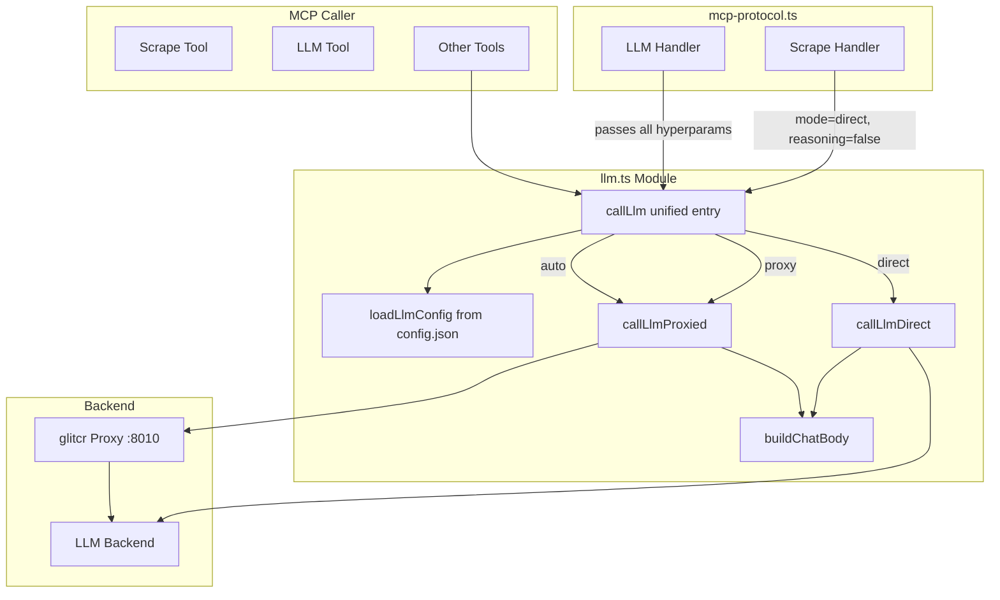
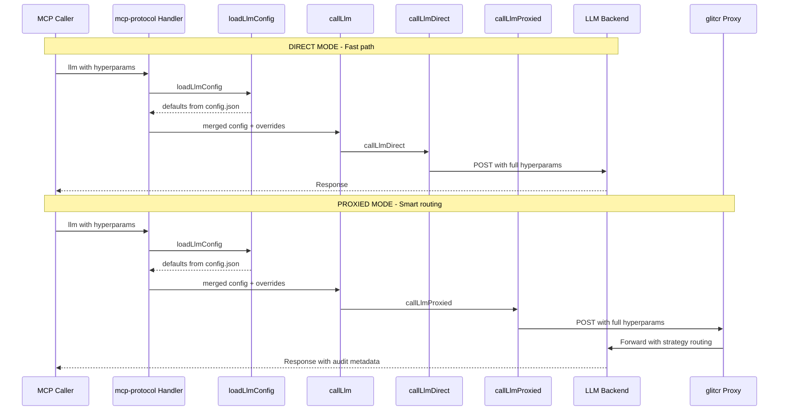

# LLM Dual-Mode Architecture Plan with Hyperparameter Support

## Overview

Redesign the `llm()` tool to support two call modes with full hyperparameter support:

1. **Direct mode** - Calls the LLM backend directly (bypassing glitcr proxy). Fast, minimal overhead. Ideal for simple text transformations like dedup/mainTopicFocus in scrape.
2. **Proxied mode** - Calls through glitcr proxy. Enables smart routing, strategies, MCP tools, audit logging. For advanced use cases.
3. **Auto mode** - Lets glitcr decide routing based on request complexity.

Config is read from `~/.aidana/config.json` as defaults. Per-call hyperparameters override config values, enabling callers to customize model, endpoint, and generation parameters on every call.

## Architecture





## Config Structure

**File:** `~/.aidana/config.json`

```json
{
  "llm": {
    "endpoint": "http://baradcuda:8920/v1",
    "apiKey": "local-dev-key",
    "model": "Qwen3.6-27B-FP8",
    "proxy": {
      "port": 8010,
      "admin_user": "admin",
      "admin_password": "changeme",
      "autoStart": true
    }
  }
}
```

## Hyperparameter Priority

Values are resolved in this order (highest priority first):

1. **Per-call argument** - Passed in MCP tool call
2. **Config.json default** - Read from `~/.aidana/config.json`
3. **Hardcoded fallback** - Safe defaults in code

## Implementation Details

### 1. New `llm.ts` - Dual-mode with full hyperparameters

**File:** [`browser-extension/src/tools/llm.ts`](browser-extension/src/tools/llm.ts)

#### Config Loader

```typescript
import { readFile } from "node:fs/promises";
import { join } from "node:path";
import { homedir } from "node:os";

interface LlmConfig {
  endpoint: string;
  apiKey: string;
  model: string;
  proxyPort: number;
}

const CONFIG_PATH = join(homedir(), ".aidana", "config.json");

async function loadLlmConfig(): Promise<LlmConfig> {
  const raw = await readFile(CONFIG_PATH, "utf-8");
  const config = JSON.parse(raw) as { llm?: { endpoint: string; apiKey: string; model: string; proxy?: { port: number } } };
  const llm = config.llm;
  if (!llm) throw new Error("No llm config in ~/.aidana/config.json");
  return {
    endpoint: llm.endpoint,
    apiKey: llm.apiKey,
    model: llm.model,
    proxyPort: llm.proxy?.port ?? 8010,
  };
}
```

#### LlmPayload with Full Hyperparameters

```typescript
export type LlmCallMode = "direct" | "proxy" | "auto";

export interface LlmPayload {
  // Core
  prompt: string;

  // Mode
  mode?: LlmCallMode;

  // Endpoint overrides
  endpoint?: string;
  apiKey?: string;
  model?: string;

  // Generation hyperparameters
  temperature?: number;
  maxTokens?: number;
  topP?: number;
  topK?: number;
  seed?: number;
  presencePenalty?: number;
  frequencyPenalty?: number;
  repetitionPenalty?: number;

  // Reasoning
  enableThinking?: boolean;

  // Advanced
  recursionDepth?: number;

  // Embedding (for future use)
  embeddingEndpoint?: string;
  embeddingModel?: string;
  embeddingApiKey?: string;

  // NER / Relation / Rerank (for future use)
  nerModel?: string;
  relationModel?: string;
  rerankModel?: string;
}

export interface LlmResult {
  text: string;
  model?: string;
  reasoningContent?: string;
  usage?: { promptTokens: number; completionTokens: number; totalTokens: number };
}
```

#### Unified `callLlm` Function

```typescript
export async function callLlm(payload: LlmPayload): Promise<LlmResult> {
  const config = await loadLlmConfig();
  const mode = payload.mode ?? "proxy";

  // Merge: per-call overrides take priority over config defaults
  const merged = {
    endpoint: payload.endpoint ?? config.endpoint,
    apiKey: payload.apiKey ?? config.apiKey,
    model: payload.model ?? config.model,
    proxyPort: config.proxyPort,
  };

  if (mode === "direct") {
    return callLlmDirect(payload, merged);
  }
  return callLlmProxied(payload, merged);
}
```

#### Request Body Builder

```typescript
function buildChatBody(payload: LlmPayload, model: string): Record<string, unknown> {
  const body: Record<string, unknown> = {
    model,
    messages: [{ role: "user", content: payload.prompt }],
    stream: false,
  };

  // Generation hyperparameters (only include if defined)
  if (payload.maxTokens !== undefined) body.max_tokens = payload.maxTokens;
  if (payload.temperature !== undefined) body.temperature = payload.temperature;
  if (payload.topP !== undefined) body.top_p = payload.topP;
  if (payload.topK !== undefined) body.top_k = payload.topK;
  if (payload.seed !== undefined) body.seed = payload.seed;
  if (payload.presencePenalty !== undefined) body.presence_penalty = payload.presencePenalty;
  if (payload.frequencyPenalty !== undefined) body.frequency_penalty = payload.frequencyPenalty;
  if (payload.repetitionPenalty !== undefined) body.repetition_penalty = payload.repetitionPenalty;

  // Reasoning / thinking
  if (payload.enableThinking) {
    body.reasoning_effort = "high";
  }

  return body;
}
```

#### Direct Call

```typescript
async function callLlmDirect(
  payload: LlmPayload,
  config: { endpoint: string; apiKey: string; model: string },
): Promise<LlmResult> {
  const url = `${config.endpoint}/chat/completions`;
  const body = buildChatBody(payload, config.model);

  const response = await fetch(url, {
    method: "POST",
    headers: {
      "Content-Type": "application/json",
      "Authorization": `Bearer ${config.apiKey}`,
    },
    body: JSON.stringify(body),
  });

  if (!response.ok) {
    const errorText = await response.text();
    throw new Error(`LLM direct call failed ${response.status}: ${errorText}`);
  }

  return parseChatResponse(await response.json() as any);
}
```

#### Proxied Call

```typescript
async function callLlmProxied(
  payload: LlmPayload,
  config: { endpoint: string; apiKey: string; model: string; proxyPort: number },
): Promise<LlmResult> {
  const url = `http://127.0.0.1:${config.proxyPort}/v1/chat/completions`;
  const body = buildChatBody(payload, config.model);

  const response = await fetch(url, {
    method: "POST",
    headers: { "Content-Type": "application/json" },
    body: JSON.stringify(body),
  });

  if (!response.ok) {
    const errorText = await response.text();
    throw new Error(`LLM proxied call failed ${response.status}: ${errorText}`);
  }

  return parseChatResponse(await response.json() as any);
}
```

#### Response Parser

```typescript
function parseChatResponse(data: any): LlmResult {
  const choice = data.choices?.[0];
  if (!choice) throw new Error("Empty LLM response");

  const result: LlmResult = {
    text: choice.message?.content ?? "",
    model: data.model,
    usage: data.usage ? {
      promptTokens: data.usage.prompt_tokens,
      completionTokens: data.usage.completion_tokens,
      totalTokens: data.usage.total_tokens,
    } : undefined,
  };

  if (choice.message?.reasoning_content) {
    result.reasoningContent = choice.message.reasoning_content;
  }

  return result;
}
```

### 2. Update `mcpMeta` with full inputSchema

**File:** [`browser-extension/src/tools/llm.ts`](browser-extension/src/tools/llm.ts:30)

```typescript
export const mcpMeta: McpToolMeta = {
  workItemType: "llm",
  name: "llm",
  description:
    "Send a prompt to the LLM. Supports direct backend calls (mode=direct) or proxied calls via glitcr (mode=proxy) with smart routing. All generation hyperparameters can be overridden per-call.",
  inputSchema: {
    type: "object",
    properties: {
      prompt: {
        type: "string",
        description: "The prompt to send to the LLM",
      },
      mode: {
        type: "string",
        enum: ["direct", "proxy", "auto"],
        description: "Call mode: 'direct' (call LLM backend directly), 'proxy' (via glitcr with smart routing), 'auto' (glitcr decides). Default: 'proxy'",
        default: "proxy",
      },
      // Endpoint overrides
      endpoint: {
        type: "string",
        description: "Override LLM endpoint URL (e.g. 'http://127.0.0.1:11434/v1')",
      },
      apiKey: {
        type: "string",
        description: "Override API key for LLM backend",
      },
      model: {
        type: "string",
        description: "Override model name (e.g. 'qwen2.5-coder:14b')",
      },
      // Generation hyperparameters
      temperature: {
        type: "number",
        description: "Sampling temperature. Default: from config",
      },
      maxTokens: {
        type: "number",
        description: "Maximum tokens in response. Default: 4096",
        default: 4096,
      },
      topP: {
        type: "number",
        description: "Top-p nucleus sampling. Default: 1",
      },
      topK: {
        type: "number",
        description: "Top-k sampling. Default: 40",
      },
      seed: {
        type: "number",
        description: "Random seed for reproducibility",
      },
      presencePenalty: {
        type: "number",
        description: "Presence penalty. Default: 0",
      },
      frequencyPenalty: {
        type: "number",
        description: "Frequency penalty. Default: 0",
      },
      repetitionPenalty: {
        type: "number",
        description: "Repetition penalty. Default: 1.05",
      },
      // Reasoning
      enableThinking: {
        type: "boolean",
        description: "Enable extended thinking/reasoning mode. Default: false",
        default: false,
      },
      // Advanced
      recursionDepth: {
        type: "number",
        description: "Maximum recursion depth for proxy strategies. Default: 0",
        default: 0,
      },
      // Embedding (future)
      embeddingEndpoint: {
        type: "string",
        description: "Override embedding endpoint URL",
      },
      embeddingModel: {
        type: "string",
        description: "Override embedding model name",
      },
      embeddingApiKey: {
        type: "string",
        description: "Override embedding API key",
      },
      // NER / Relation / Rerank (future)
      nerModel: {
        type: "string",
        description: "NER model name",
      },
      relationModel: {
        type: "string",
        description: "Relation extraction model name",
      },
      rerankModel: {
        type: "string",
        description: "Reranker model name",
      },
    },
    required: ["prompt"],
  },
};
```

### 3. Update `mcp-protocol.ts` - LLM handler passes all hyperparams

**File:** [`browser-extension/src/server/mcp-protocol.ts`](browser-extension/src/server/mcp-protocol.ts:485)

```typescript
if (name === "llm") {
  try {
    const { callLlm } = await import("../tools/llm.js");
    const args = request.params.arguments as Record<string, unknown>;
    const llmResult = await callLlm({
      prompt: args.prompt as string,
      mode: (args.mode as "direct" | "proxy" | "auto") ?? "proxy",
      // Endpoint overrides
      endpoint: args.endpoint as string | undefined,
      apiKey: args.apiKey as string | undefined,
      model: args.model as string | undefined,
      // Generation hyperparameters
      temperature: args.temperature as number | undefined,
      maxTokens: args.maxTokens as number | undefined,
      topP: args.topP as number | undefined,
      topK: args.topK as number | undefined,
      seed: args.seed as number | undefined,
      presencePenalty: args.presencePenalty as number | undefined,
      frequencyPenalty: args.frequencyPenalty as number | undefined,
      repetitionPenalty: args.repetitionPenalty as number | undefined,
      // Reasoning
      enableThinking: args.enableThinking as boolean | undefined,
      // Advanced
      recursionDepth: args.recursionDepth as number | undefined,
      // Embedding
      embeddingEndpoint: args.embeddingEndpoint as string | undefined,
      embeddingModel: args.embeddingModel as string | undefined,
      embeddingApiKey: args.embeddingApiKey as string | undefined,
      // NER / Relation / Rerank
      nerModel: args.nerModel as string | undefined,
      relationModel: args.relationModel as string | undefined,
      rerankModel: args.rerankModel as string | undefined,
    });
    const output: Record<string, unknown> = { text: llmResult.text };
    if (llmResult.model) output.model = llmResult.model;
    if (llmResult.reasoningContent) output.reasoningContent = llmResult.reasoningContent;
    if (llmResult.usage) output.usage = llmResult.usage;
    return { content: [{ type: "text", text: JSON.stringify(output, null, 2) }] };
  } catch (err: unknown) {
    const message = err instanceof Error ? err.message : String(err);
    return {
      content: [{ type: "text", text: `LLM error: ${message}` }],
      isError: true,
    };
  }
}
```

### 4. Update `mcp-protocol.ts` - Scrape uses direct mode

**File:** [`browser-extension/src/server/mcp-protocol.ts`](browser-extension/src/server/mcp-protocol.ts:172)

```typescript
if (dedup || mainTopicFocus) {
  try {
    const { callLlm } = await import("../tools/llm.js");
    const parts: string[] = [];
    if (mainTopicFocus) {
      parts.push(`Extract and focus only on content related to: "${mainTopicFocus}". Ignore unrelated sections.`);
    }
    if (dedup) {
      parts.push("Remove repetitive, redundant, or duplicate content. Keep the output concise while preserving all unique information.");
    }
    parts.push("Return the processed content directly without preamble or explanation.");
    const llmPrompt = parts.join("\n") + "\n\nContent:\n" + content;

    // DIRECT mode: fast, no-thinking text transformation
    const llmResult = await callLlm({
      prompt: llmPrompt,
      mode: "direct",
      enableThinking: false,
      maxTokens: 2048,
    });
    content = llmResult.text;
  } catch (llmErr) {
    const llmError = llmErr instanceof Error ? llmErr.message : String(llmErr);
    content = `[Note: LLM post-processing failed: ${llmError}. Returning original content.]\n\n` + content;
  }
}
```

### 5. E2E Tests

**File:** [`mcp_tests/test-llm-dual-mode.ts`](mcp_tests/test-llm-dual-mode.ts) (new)

#### Test Matrix

| # | Mode | enableThinking | maxTokens | Other Params | Validates |
|---|------|---------------|-----------|--------------|-----------|
| T1 | direct | false | 100 | - | Direct works, no reasoningContent |
| T2 | direct | false | (default) | - | Direct default tokens |
| T3 | direct | true | 100 | - | reasoningContent present |
| T4 | proxy | false | 100 | - | Proxy works, no reasoningContent |
| T5 | proxy | false | (default) | - | Proxy default tokens |
| T6 | proxy | true | 100 | - | reasoningContent present |
| T7 | (default) | false | 100 | - | Defaults to proxy mode |
| T8 | direct | false | 100 | temperature=0, seed=42 | Hyperparams passed |
| T9 | direct | false | 100 | topP=0.9, topK=20 | Sampling params passed |
| T10 | direct | false | 100 | repetitionPenalty=1.1 | Penalty params passed |
| T11 | direct | false | 100 | model="qwen2.5-coder:14b" | Model override |
| T12 | proxy | false | 100 | recursionDepth=2 | Advanced params |

#### Test Structure

```typescript
async function testLlm(
  name: string,
  args: Record<string, unknown>,
  assertions: (parsed: any) => void,
): Promise<void> {
  console.log(`  [${name}] Calling llm with:`, JSON.stringify(args));
  const result = await session.callTextTool("llm", args);
  const parsed = JSON.parse(result);
  assertions(parsed);
  console.log(`    OK`);
}

// Example tests
await testLlm("T1: direct/no-thinking/100tokens", {
  prompt: "Reply with exactly: HELLO_WORLD",
  mode: "direct",
  enableThinking: false,
  maxTokens: 100,
}, (p) => {
  assert(p.text, "text present");
  assert(p.reasoningContent === undefined, "no reasoningContent");
});

await testLlm("T8: direct/hyperparams", {
  prompt: "Reply with exactly: HYPERPARAM_TEST",
  mode: "direct",
  enableThinking: false,
  maxTokens: 100,
  temperature: 0,
  seed: 42,
}, (p) => {
  assert(p.text, "text present");
});
```

#### Scrape Dedup Tests

**File:** [`mcp_tests/test-scrape-dedup.ts`](mcp_tests/test-scrape-dedup.ts) (new)

| # | Params | Validates |
|---|--------|-----------|
| S1 | `dedup: true, format: md` | Valid JSON, no LLM error note |
| S2 | `mainTopicFocus: "test", format: md` | Valid JSON, no LLM error note |
| S3 | `dedup: true, mainTopicFocus: "test"` | Both params work together |
| S4 | `format: json, dedup: true` | JSON format with dedup |
| S5 | `format: html, dedup: true` | HTML format with dedup |

### 6. Update `package.json`

**File:** [`browser-extension/package.json`](browser-extension/package.json)

```json
"test:llm": "tsx ../mcp_tests/test-llm-dual-mode.ts",
"test:scrape-dedup": "tsx ../mcp_tests/test-scrape-dedup.ts"
```

### 7. Update `Makefile`

**File:** [`Makefile`](Makefile)

```makefile
test: restart
	@echo "Running all MCP integration tests"
	cd $(BROWSER_EXTENSION_DIR) && bun run test:mcp
	cd mcp_tests && bun run test-web-search.ts
	cd mcp_tests && bun run test-llm-dual-mode.ts
	cd mcp_tests && bun run test-scrape-dedup.ts
```

## Files Summary

| File | Action | Key Changes |
|------|--------|-------------|
| [`llm.ts`](browser-extension/src/tools/llm.ts) | **Rewrite** | Dual-mode, config loader, full hyperparams, `buildChatBody` |
| [`mcp-protocol.ts`](browser-extension/src/server/mcp-protocol.ts) | **Modify** | LLM handler passes all params, scrape uses `mode: "direct"` |
| [`mcp_tests/test-llm-dual-mode.ts`](mcp_tests/test-llm-dual-mode.ts) | **Create** | 12-test matrix covering modes, hyperparams, thinking |
| [`mcp_tests/test-scrape-dedup.ts`](mcp_tests/test-scrape-dedup.ts) | **Create** | 5 scrape dedup/mainTopicFocus tests |
| [`package.json`](browser-extension/package.json) | **Modify** | Add `test:llm` and `test:scrape-dedup` scripts |
| [`Makefile`](Makefile) | **Modify** | Add new test targets |

## Key Design Decisions

1. **Config from `~/.aidana/config.json`** - Single source of truth for defaults. No env var fallback in TypeScript.

2. **Per-call overrides** - Every hyperparameter can be overridden per MCP call, matching the `X-Aidana-*` header pattern.

3. **Default mode is `proxy`** - Backward compatible. Internal calls (scrape) explicitly use `mode: "direct"`.

4. **`enableThinking` replaces `reasoning`** - New param name matches the `X-Aidana-EnableThinking` header convention. Maps to `reasoning_effort: "high"` in the OpenAI body.

5. **Optional hyperparams** - Only defined hyperparams are included in the request body. Undefined params are omitted, letting the backend use its defaults.

6. **Graceful fallback in scrape** - If LLM call fails, scrape returns original content with a note.

7. **Future-ready** - Embedding, NER, Relation, and Rerank params are in the schema for future use but not yet wired into request bodies.

## Implementation Order

1. Rewrite [`llm.ts`](browser-extension/src/tools/llm.ts) with dual-mode + full hyperparams
2. Update [`mcp-protocol.ts`](browser-extension/src/server/mcp-protocol.ts) LLM handler
3. Update [`mcp-protocol.ts`](browser-extension/src/server/mcp-protocol.ts) scrape handler
4. Create [`mcp_tests/test-llm-dual-mode.ts`](mcp_tests/test-llm-dual-mode.ts)
5. Create [`mcp_tests/test-scrape-dedup.ts`](mcp_tests/test-scrape-dedup.ts)
6. Update [`package.json`](browser-extension/package.json)
7. Update [`Makefile`](Makefile)
8. Run `make test` to verify all green
