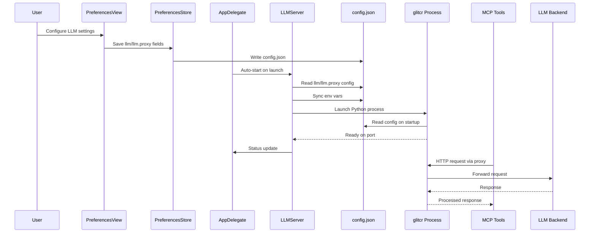
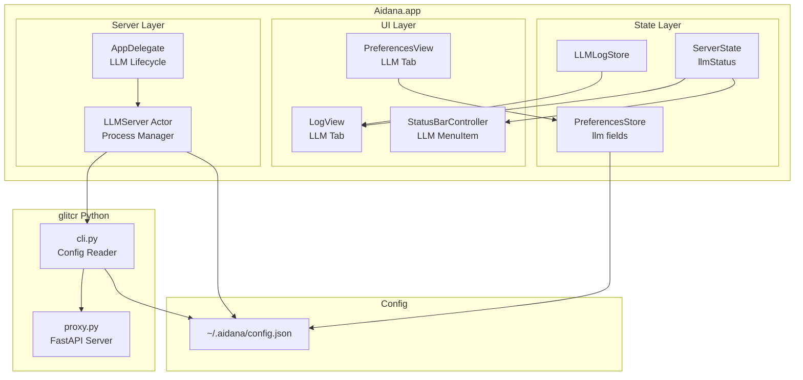
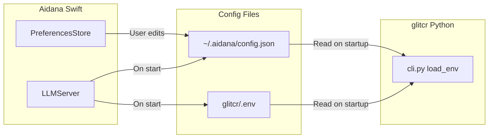
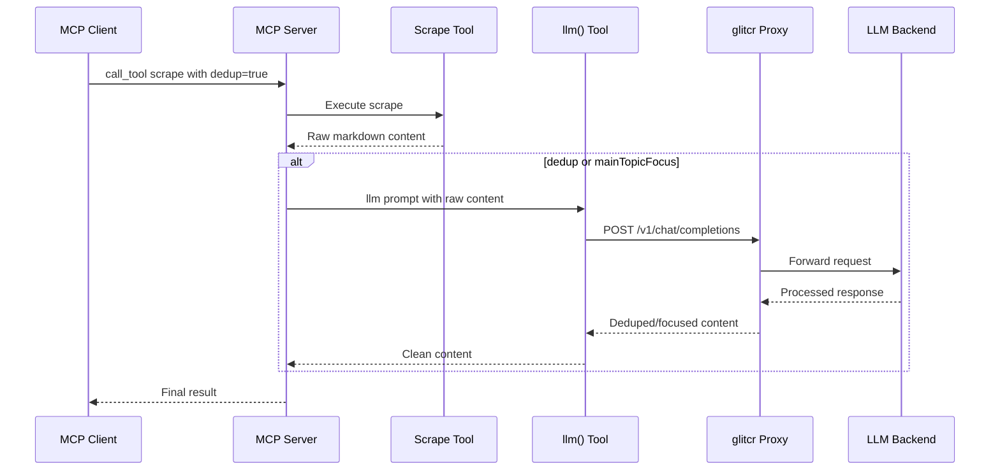

# LLM Integration Architecture Plan

## Overview

Add LLM (Large Language Model) proxy integration to Aidana, enabling MCP tools (like `scrape` with dedup/main-topic-focus) to access an LLM via a locally-hosted glitcr proxy. The glitcr server is managed as a subprocess of Aidana, similar to MCP and TTS servers.

## Config File: `~/.aidana/config.json`

A single JSON file with nested `llm` object containing proxy config:

```json
{
  "llm": {
    "endpoint": "http://baradcuda:8920/v1",
    "apiKey": "local-dev-key",
    "model": "Qwen3.6-27B-FP8",
    "proxy": {
      "port": 8010,
      "admin_user": "admin",
      "admin_password": "changeme",
      "autoStart": true
    }
  }
}
```

The `llm` fields map 1:1 to glitcr env vars:
- `llm.endpoint` → `OPENAI_BASE_URL`
- `llm.apiKey` → `OPENAI_API_KEY`
- `llm.model` → `TEST_MODEL_NAME`

The `llm.proxy` fields map to:
- `llm.proxy.port` → `GLITCR_PORT`
- `llm.proxy.admin_user` → `ADMIN_USER`
- `llm.proxy.admin_password` → `ADMIN_PASSWORD_PLAIN`

Auth-derived fields (`ADMIN_PASSWORD`, `ADMIN_SALT`, `ADMIN_KDF_ITERATIONS`) are generated via the glitcr `auth create` command (non-interactive, passed email + clear-text password as args). This is only triggered when the user clicks "Update" in the LLM settings UI.

## Architecture Diagram





## Implementation Steps

### Step 1: PreferencesStore.swift - Add LLM preference fields

**File:** [`Aidana/Preferences/PreferencesStore.swift`](Aidana/Preferences/PreferencesStore.swift)

Add new `@Published` properties following existing patterns. Fields map to nested config shape `llm.{field}` and `llm.proxy.{field}`:

```swift
@Published var llmEndpoint: String        // llm.endpoint
@Published var llmApiKey: String          // llm.apiKey
@Published var llmModel: String           // llm.model
@Published var llmProxyPort: Int          // llm.proxy.port
@Published var llmProxyAdminUser: String  // llm.proxy.admin_user
@Published var llmProxyAdminPassword: String // llm.proxy.admin_password
@Published var llmAutoStart: Bool         // llm.proxy.autoStart
```

Add corresponding `Keys` entries and defaults:
- `llmEndpoint`: `""`
- `llmApiKey`: `""`
- `llmModel`: `""`
- `llmProxyPort`: `8010`
- `llmProxyAdminUser`: `"admin"`
- `llmProxyAdminPassword`: `"changeme"`
- `llmAutoStart`: `true`

### Step 2: ServerState.swift - Add LLMStatus enum

**File:** [`Aidana/Server/ServerState.swift`](Aidana/Server/ServerState.swift)

Add `LLMStatus` enum matching `MCPStatus` pattern:

```swift
enum LLMStatus: Equatable {
    case stopped
    case starting
    case ready(port: Int)
    case error(String)
}
```

Add `@Published private(set) var llmStatus: LLMStatus = .stopped` and `setLLMStatus()` method.

### Step 3: LogStore.swift - Add LLMLogStore

**File:** [`Aidana/Support/LogStore.swift`](Aidana/Support/LogStore.swift)

Add:
```swift
@MainActor
final class LLMLogStore: LogStore {}
```

### Step 4: StatusBarController.swift - Add LLM menu item

**File:** [`Aidana/UI/MenuBar/StatusBarController.swift`](Aidana/UI/MenuBar/StatusBarController.swift)

Add `llmInfoItem` NSMenuItem and wire it to observe `serverState.$llmStatus`.

Menu order: ASR → TTS → MCP → **LLM** → separator → Log → Preferences → Quit

### Step 5: LLMServer.swift - Create the server actor

**File:** [`Aidana/Server/LLMServer.swift`](Aidana/Server/LLMServer.swift) (new file)

Follow `MCPServer.swift` / `TTSServer.swift` patterns:

- `actor LLMServer` with `Process` management
- `start(configuration: LaunchConfiguration)` - resolves glitcr Python path, writes config.json, launches process
- `stopAndWait()` / `stop()` / `waitUntilStopped()`
- `waitForReady(port:timeout:)` - polls `http://127.0.0.1:$port/health`
- `killStaleProcesses()` - `pkill -f "glitcr"`
- `onLog` callback for stdout/stderr
- `isRunning` property
- `LaunchConfiguration` struct with endpoint, apiKey, model, proxyPort, proxyAdminUser, proxyAdminPassword

**Config sync:** Before starting, write `~/.aidana/config.json` with nested `llm` + `llm.proxy` structure. Also write glitcr `.env` file from config for backward compatibility.

**Auth create:** When the user clicks "Update" in settings, call glitcr's `auth create` command non-interactively (passing `--email` and `--password` as CLI args, not waiting for stdin). This generates `ADMIN_PASSWORD` hash, `ADMIN_SALT`, and `ADMIN_KDF_ITERATIONS` into the `.env` file.

Python path resolution:
```swift
private static func pythonPath() -> String {
    // Resolve to project root /glitcr/.venv/bin/python
}
```

### Step 6: AppDelegate.swift - Wire LLM lifecycle

**File:** [`Aidana/Application/AppDelegate.swift`](Aidana/Application/AppDelegate.swift)

- Add `private let llmServer = LLMServer()`
- Add `private let llmLogStore = LLMLogStore()`
- Set up log callback in `startServer()` lifecycle task
- Add `startLLMServer()` method called after MCP startup
- Add `enum LLMAction` and `enqueueLLMAction()` / `performLLMAction()` pattern matching MCP
- Handle `applicationWillTerminate` - kill glitcr processes

### Step 7: LogView.swift - Add LLM log tab

**File:** [`Aidana/UI/LogView.swift`](Aidana/UI/LogView.swift)

Add `LLMLogTab` to the `TabView`:

```swift
LLMLogTab()
    .environmentObject(llmLogStore)
    .tabItem { Label("LLM", systemImage: "brain") }
```

### Step 8: PreferencesView.swift - Add LLM preferences tab

**File:** [`Aidana/UI/Preferences/PreferencesView.swift`](Aidana/UI/Preferences/PreferencesView.swift)

Add `LLMPreferencesTab` to the main `TabView` with:

- **LLM Endpoint Section:**
  - `SecureField` for API Key
  - `TextField` for Endpoint URL
  - `TextField` for Model Name

- **Proxy Configuration Section:**
  - `TextField` for Port (number)
  - `TextField` for Admin User
  - `SecureField` for Admin Password

- **Status/Controls Section:**
  - Status indicator (color-coded)
  - Start / Stop / Restart buttons
  - Auto-start toggle
  - **"Update" button** - triggers auth-create (non-interactive) + writes config.json + restarts glitcr

- **Config JSON preview** showing current `~/.aidana/config.json` content

### Step 9: Modify glitcr Python to read config.json

**Files:** [`glitcr/src/glitcr/cli.py`](glitcr/src/glitcr/cli.py), [`glitcr/src/glitcr/paths.py`](glitcr/src/glitcr/paths.py)

In `cli.py`, modify `load_env()` to also check `~/.aidana/config.json`:

```python
def load_config() -> dict:
    """Load config from ~/.aidana/config.json, falling back to .env."""
    config_path = Path.home() / ".aidana" / "config.json"
    if config_path.exists():
        import json
        return json.loads(config_path.read_text())
    return {}
```

Modify `load_env()` to merge config.json values with .env (config.json takes priority for LLM fields, .env takes priority for auth-derived fields like ADMIN_PASSWORD hash).

**Make auth-create non-interactive:** The `auth_create` command in `cli.py` currently uses `typer.Option` which requires `--email` and `--password` flags. Ensure it doesn't prompt for stdin input. The command should be callable as:
```
python -m glitcr auth create --email admin --password changeme
```

### Step 10: Add internal `llm()` MCP tool

**File:** [`browser-extension/src/tools/llm.ts`](browser-extension/src/tools/llm.ts) (new file)

Create an internal MCP tool for LLM-assisted content processing:

```typescript
// Input schema
{
  prompt: { type: "string", description: "The prompt to send to the LLM" },
  reasoning: { type: "boolean", description: "Enable reasoning/chain-of-thought. Default: false", default: false }
}
```

This tool calls the glitcr proxy endpoint (from `~/.aidana/config.json`) with the configured API key, model, and endpoint. The proxy handles routing, caching, and audit logging.

When `reasoning: true`, the tool includes extended thinking parameters in the LLM request.

### Step 11: Add dedup/main_topic_focus to scrape tool

**Files:** [`browser-extension/src/tools/scrape.ts`](browser-extension/src/tools/scrape.ts), [`browser-extension/src/server/mcp-protocol.ts`](browser-extension/src/server/mcp-protocol.ts)

Add to `ScrapePayload`:
```typescript
dedup?: boolean;
mainTopicFocus?: boolean;
```

Add to `mcpMeta.inputSchema`:
```json
{
  "dedup": { "type": "boolean", "description": "Deduplicate repeated content blocks using LLM. Default: false", "default": false },
  "mainTopicFocus": { "type": "boolean", "description": "Focus output on main topic using LLM, removing navigation/sidebar. Default: false", "default": false }
}
```

When `dedup` or `mainTopicFocus` is true and format is `md`, the scrape handler calls the internal `llm()` tool with a prompt that instructs the LLM to:
- For `dedup`: Remove duplicate/repeated content blocks while preserving unique information
- For `mainTopicFocus`: Extract and focus on the main topic, removing navigation, sidebars, ads, and unrelated content

### Step 12: Update MCP client config JSON

**File:** [`Aidana/UI/Preferences/PreferencesView.swift`](Aidana/UI/Preferences/PreferencesView.swift)

Update `mcpClientConfigJSON` computed property to include the LLM proxy endpoint so MCP tools know where to reach the LLM for processing.

### Step 13: Build and test

Run `make restart` then verify:
- LLM status appears in menu bar
- LLM tab appears in preferences
- LLM tab appears in logs
- `~/.aidana/config.json` is created with proper nested structure
- Glitcr starts and responds on configured port
- "Update" button in settings triggers auth-create + restart
- `scrape` with `dedup: true` or `mainTopicFocus: true` calls LLM via glitcr proxy

## Data Flow: Config Sync



## Data Flow: LLM-assisted Scrape



## Key Design Decisions

1. **Nested config shape** (`llm.proxy` inside `llm`) keeps all LLM-related config in one top-level key.

2. **Glitcr as subprocess** managed by `LLMServer` actor, following the same pattern as `MCPServer` and `TTSServer` for consistency.

3. **Config.json + .env dual source** for glitcr - Aidana writes both, but glitcr Python reads config.json first for LLM fields and .env for auth-derived fields.

4. **Auto-start** enabled by default, matching MCP behavior.

5. **Auth-create is non-interactive** - called with `--email` and `--password` CLI args, triggered only by "Update" button in UI.

6. **Internal `llm()` tool** provides a standardized way for MCP tools to access the LLM through glitcr proxy, supporting reasoning mode for complex tasks.

7. **Dedup/mainTopicFocus** are post-processing steps that call the LLM to clean up scraped content, only active when explicitly requested.
