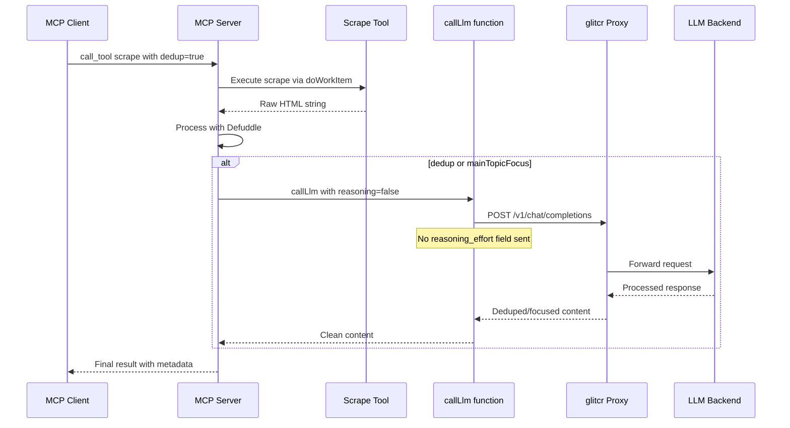

# Scrape Tool - Dedup & MainTopicFocus Implementation Plan

## Overview

The scrape tool already has `dedup` and `mainTopicFocus` parameters in the payload and MCP schema. The LLM post-processing logic exists in `mcp-protocol.ts` but needs fixes for the user's requirements: **no reasoning mode** and **focused, minimal output**. An end-to-end test is also required.

## Current State

| Component | Status | Notes |
|-----------|--------|-------|
| [`ScrapePayload`](browser-extension/src/tools/scrape.ts:17) | ✅ Done | Has `dedup?: boolean` and `mainTopicFocus?: string` |
| [`mcpMeta.inputSchema`](browser-extension/src/tools/scrape.ts:41) | ✅ Done | Schema includes both params |
| [`callLlm()`](browser-extension/src/tools/llm.ts:65) | ⚠️ Needs fix | Default `GLITCR_PORT` is `18645`, should be `8010` |
| LLM post-processing in [`mcp-protocol.ts`](browser-extension/src/server/mcp-protocol.ts:172) | ⚠️ Needs fix | Uses `reasoning: true`, must be `false` |
| End-to-end test | ❌ Missing | No test for dedup/mainTopicFocus |

## Required Changes

### 1. Fix `mcp-protocol.ts` - Disable reasoning for scrape post-processing

**File:** [`browser-extension/src/server/mcp-protocol.ts`](browser-extension/src/server/mcp-protocol.ts:185)

**Current code (line 185):**
```typescript
const llmResult = await callLlm({ prompt: llmPrompt, reasoning: true });
```

**Fix:** Change `reasoning: true` to `reasoning: false` and add `maxTokens` constraint for minimal output:
```typescript
const llmResult = await callLlm({ prompt: llmPrompt, reasoning: false, maxTokens: 2048 });
```

**Rationale:** The user explicitly requires "No thinking enabled" for dedup/focus operations. The `maxTokens: 2048` ensures the LLM returns the smallest, most focused data possible.

### 2. Fix `llm.ts` - Correct default GLITCR_PORT

**File:** [`browser-extension/src/tools/llm.ts`](browser-extension/src/tools/llm.ts:66)

**Current code (line 66):**
```typescript
const proxyPort = parseInt(process.env.GLITCR_PORT ?? "18645", 10);
```

**Fix:**
```typescript
const proxyPort = parseInt(process.env.GLITCR_PORT ?? "8010", 10);
```

**Rationale:** The actual glitcr config in [`glitcr/.env`](glitcr/.env:7) sets `GLITCR_PORT=8010`. The default must match.

### 3. Create end-to-end test for dedup and mainTopicFocus

**File:** [`mcp_tests/test-scrape-dedup.ts`](mcp_tests/test-scrape-dedup.ts) (new file)

**Test cases:**

#### Test A: Basic scrape with `dedup: true`
```typescript
// Scrape a page with repetitive content
const result = await session.callTextTool("scrape", {
  url: "https://example.com",
  format: "md",
  dedup: true,
});
// Verify: result is valid JSON with content_type, metadata, and content fields
// Verify: content does not contain the LLM error note (meaning LLM was called successfully)
```

#### Test B: Scrape with `mainTopicFocus`
```typescript
const result = await session.callTextTool("scrape", {
  url: "https://example.com",
  format: "md",
  mainTopicFocus: "product pricing",
});
// Verify: result structure is valid
// Verify: content is focused (no LLM error note)
```

#### Test C: Scrape with both `dedup` and `mainTopicFocus`
```typescript
const result = await session.callTextTool("scrape", {
  url: "https://example.com",
  format: "md",
  dedup: true,
  mainTopicFocus: "user reviews",
});
// Verify: result structure is valid
```

#### Test D: Verify reasoning is NOT enabled
```typescript
// Call the llm tool directly and verify no reasoningContent in response
const llmResult = await session.callTextTool("llm", {
  prompt: "Say hello",
  reasoning: false,
});
const parsed = JSON.parse(llmResult);
// Verify: parsed.reasoningContent is undefined
```

### 4. Add test script to `package.json`

**File:** [`browser-extension/package.json`](browser-extension/package.json:19)

Add:
```json
"test:scrape-dedup": "tsx ../mcp_tests/test-scrape-dedup.ts"
```

### 5. Update `Makefile` with new test target

**File:** [`Makefile`](Makefile:43)

Add to `test` target:
```makefile
cd mcp_tests && bun run test-scrape-dedup.ts
```

## Data Flow: LLM-assisted Scrape (Corrected)



## Implementation Order

1. Fix `reasoning: false` in [`mcp-protocol.ts`](browser-extension/src/server/mcp-protocol.ts:185)
2. Fix `GLITCR_PORT` default in [`llm.ts`](browser-extension/src/tools/llm.ts:66)
3. Create [`mcp_tests/test-scrape-dedup.ts`](mcp_tests/test-scrape-dedup.ts)
4. Add test script to [`package.json`](browser-extension/package.json)
5. Update [`Makefile`](Makefile) test target
6. Run `make test` to verify end-to-end

## Key Design Decisions

1. **No reasoning mode** - Dedup and topic focus are straightforward text transformation tasks that don't benefit from extended thinking. Using `reasoning: false` reduces latency and token costs.

2. **Max tokens constraint (2048)** - Ensures the LLM returns concise, focused output. The prompt already instructs "Return the processed content directly without preamble or explanation."

3. **Graceful fallback** - If LLM is unavailable, the original content is returned with a note. This prevents the scrape from failing entirely if glitcr is down.

4. **OpenAI-compatible client** - The existing [`callLlm()`](browser-extension/src/tools/llm.ts:65) function uses standard `fetch()` to call the glitcr proxy at `/v1/chat/completions`, making it compatible with any OpenAI-compatible backend.

## Files Summary

| File | Action | Change |
|------|--------|--------|
| `browser-extension/src/server/mcp-protocol.ts` | Modify | Line 185: `reasoning: false`, add `maxTokens: 2048` |
| `browser-extension/src/tools/llm.ts` | Modify | Line 66: Default port `8010` |
| `mcp_tests/test-scrape-dedup.ts` | Create | End-to-end test for dedup/mainTopicFocus |
| `browser-extension/package.json` | Modify | Add `test:scrape-dedup` script |
| `Makefile` | Modify | Add scrape-dedup test to `test` target |
