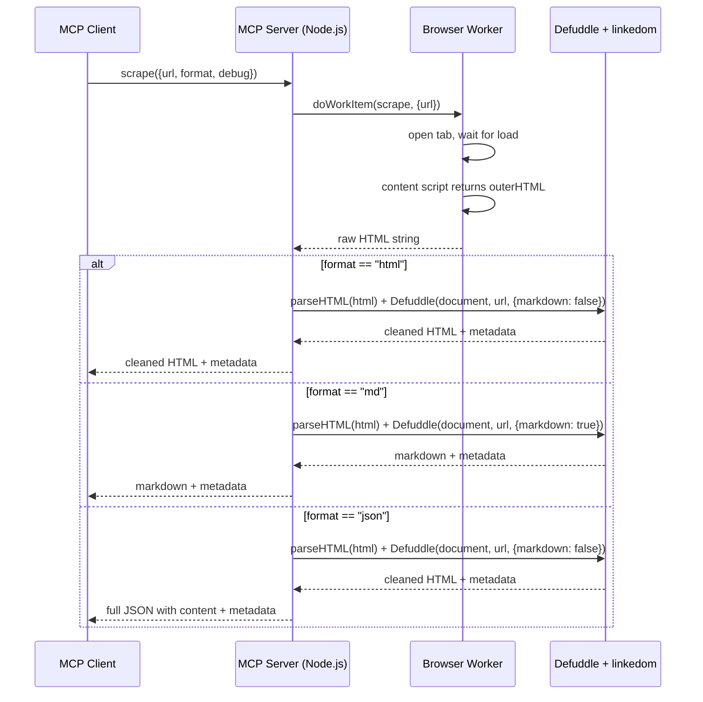

# Scrape Tool Format Enhancement Plan

## Overview
Enhance the `scrape` tool with a `format` option (`"html"`, `"json"`, `"md"`) and a `debug` option. HTML is fetched in the browser extension as before, then processed server-side with Defuddle for `md` and `json` formats.

## Architecture



## Files to Modify

| File | Action |
|------|--------|
| `browser-extension/package.json` | Add `defuddle` and `linkedom` dependencies |
| `browser-extension/src/tools/scrape.ts` | Update `ScrapePayload` and `mcpMeta` with `format` and `debug` |
| `browser-extension/src/server/mcp-protocol.ts` | Handle scrape server-side with Defuddle processing |
| `browser-extension/example-mcp-inspect.ts` | Add tests for `format=md` and `format=json` |

## Implementation Details

### 1. `browser-extension/package.json`
Add to dependencies:
```json
"defuddle": "latest",
"linkedom": "latest"
```

### 2. `browser-extension/src/tools/scrape.ts`
Update `ScrapePayload`:
```ts
export interface ScrapePayload {
  url: string;
  format?: "html" | "json" | "md";
  debug?: boolean;
}
```

Update `mcpMeta` inputSchema:
```ts
inputSchema: {
  type: "object",
  properties: {
    url: { type: "string", description: "The URL to scrape" },
    format: {
      type: "string",
      description: "Output format: 'html' (raw HTML), 'md' (Markdown with metadata), 'json' (structured JSON). Default: 'html'",
      default: "html",
    },
    debug: {
      type: "boolean",
      description: "Include debug info in response. Default: false",
      default: false,
    },
  },
  required: ["url"],
}
```

### 3. `browser-extension/src/server/mcp-protocol.ts`
Handle `scrape` tool directly (not via `doWorkItem`) since it needs server-side processing:

```ts
if (name === "scrape") {
  const url = (args as any).url;
  const format = (args as any).format ?? "html";
  const debug = (args as any).debug ?? false;

  // First, get raw HTML via work item
  const item = await doWorkItem({
    type: "scrape",
    payload: { url },
    options: { focusAutomation: true, closeTab: true },
  });

  // Process with Defuddle (all formats go through Defuddle for cleanup)
  const { parseHTML } = await import("linkedom");
  const { Defuddle } = await import("defuddle/node");
  const { document } = parseHTML(item.result);
  const result = await Defuddle(document, url, {
    markdown: format === "md",
    debug,
  });

  // Build response
  const metadata: Record<string, unknown> = {
    title: result.title ?? "",
    url,
  };
  if (result.author) metadata.author = result.author;
  if (result.language) metadata.language = result.language;
  if (result.published) metadata.published = result.published;
  if (result.wordCount) metadata.wordCount = result.wordCount;
  if (result.metaTags) metadata.metaTags = result.metaTags;
  if (result.schemaOrgData) metadata.schemaOrgData = result.schemaOrgData;
  if (debug && result.debug) metadata.debug = result.debug;

  if (format === "md") {
    const content = result.contentMarkdown ?? result.content;
    const output = { metadata, content };
    return { content: [{ type: "text", text: JSON.stringify(output, null, 2) }] };
  }

  // format === "json"
  const output = { metadata, content: result.content };
  return { content: [{ type: "text", text: JSON.stringify(output, null, 2) }] };
}
```

Remove `scrape` from the generic `doWorkItem` fallback path.

### 4. `browser-extension/example-mcp-inspect.ts`
Add tests:
- `format=md`: Scrape example.com, verify result has `metadata.title` and `content`
- `format=json`: Scrape example.com, verify result has `metadata` and `content`

## Implementation Order
1. Add dependencies to package.json
2. Update scrape.ts with new payload and schema
3. Update mcp-protocol.ts with Defuddle processing
4. Update example-mcp-inspect.ts with format tests
5. Run `npm install` in browser-extension
6. Verify `tsc --noEmit`
