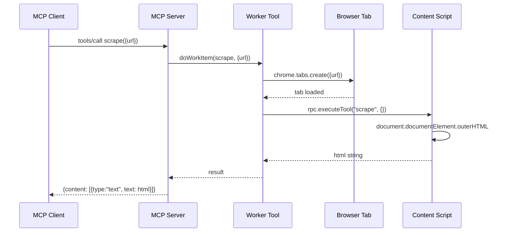

# Scrape Tool Implementation Plan

## Overview
Add a new `scrape` MCP tool that fetches the full HTML of any given URL by opening a browser tab, waiting for it to load, and returning the page HTML.

## Architecture

## Files to Modify/Create

| File | Action |
|------|--------|
| `browser-extension/src/tools/scrape.ts` | **Create** - WorkerTool, ContentScriptTool, McpToolMeta |
| `browser-extension/src/types.ts` | **Modify** - Add `"scrape"` to `WorkItemType` union |
| `browser-extension/src/mcp-tools.ts` | **Modify** - Import and register scrape meta |
| `browser-extension/src/tab-tools.ts` | **Modify** - Register scrape content script tool |

## Implementation Details

### 1. `browser-extension/src/tools/scrape.ts`
- `ScrapePayload` interface with single `url: string` field
- `mcpMeta` with `workItemType: "scrape"`, `name: "scrape"`, inputSchema with `url` (required)
- `ScrapeWorkerTool` - opens tab, waits for load, calls content script, returns HTML
- `ScrapeContentScriptTool` - waits for DOM stable, returns `document.documentElement.outerHTML`

### 2. `browser-extension/src/types.ts`
- Add `"scrape"` to `WorkItemType` union type

### 3. `browser-extension/src/mcp-tools.ts`
- Import `mcpMeta as scrape` from `./tools/scrape.js`
- Add `scrape` to `allMcpTools` array

### 4. `browser-extension/src/tab-tools.ts`
- Import `ScrapeContentScriptTool` from `./tools/scrape`
- Call `registerContentScriptTool(ScrapeContentScriptTool)`

## Implementation Order
1. Add `"scrape"` to `WorkItemType` in types.ts
2. Create `scrape.ts` with all three exports
3. Register in `mcp-tools.ts`
4. Register content script in `tab-tools.ts`
5. Verify `tsc --noEmit` passes
